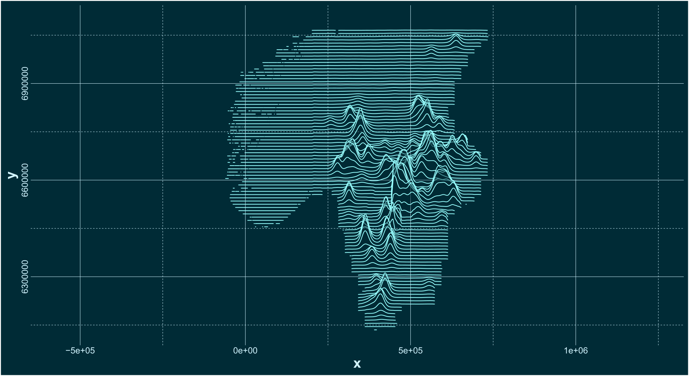

# fagrapport113_Wolves2016-2026

Repository containing the input data, R script, figures, tables and raster density maps from the following technical report:

Dupont, P., Milleret, C., Semper-Pascual, A., Brøseth, H., Flagstad, Ø., Kindberg, J., Svensson,L., and Bischof, R., 2026. **Estimates of wolf density, abundance, and population dynamics in Sweden and Norway, 2016/17–2025/26** - MINA fagrapport 113. 37 pp. [PDF LINK](https://www.researchgate.net/publication/406373173_Estimates_of_wolf_density_abundance_and_population_dynamics_in_Sweden_and_Norway_201617_-202526?channel=doi&linkId=6a26855cacb3fc46368bdf2f&showFulltext=true)

